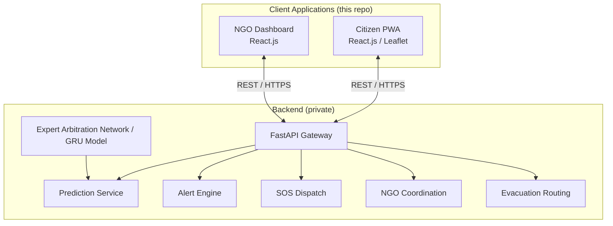
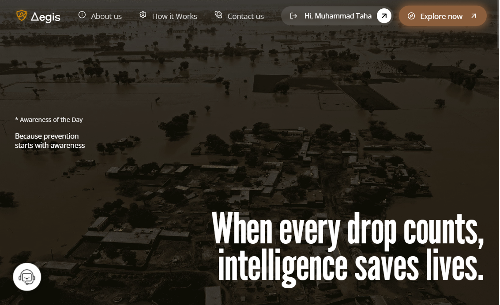
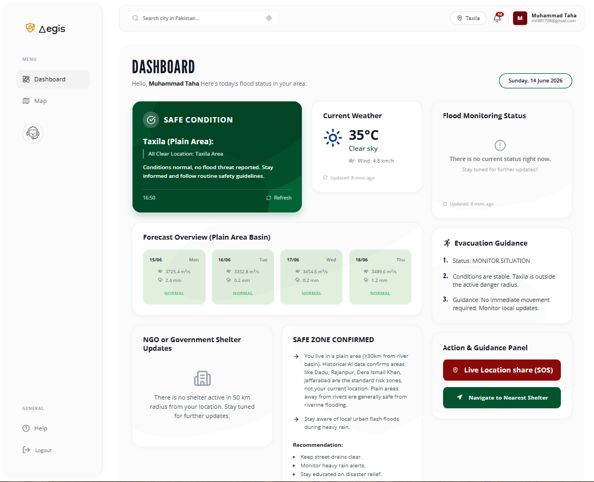
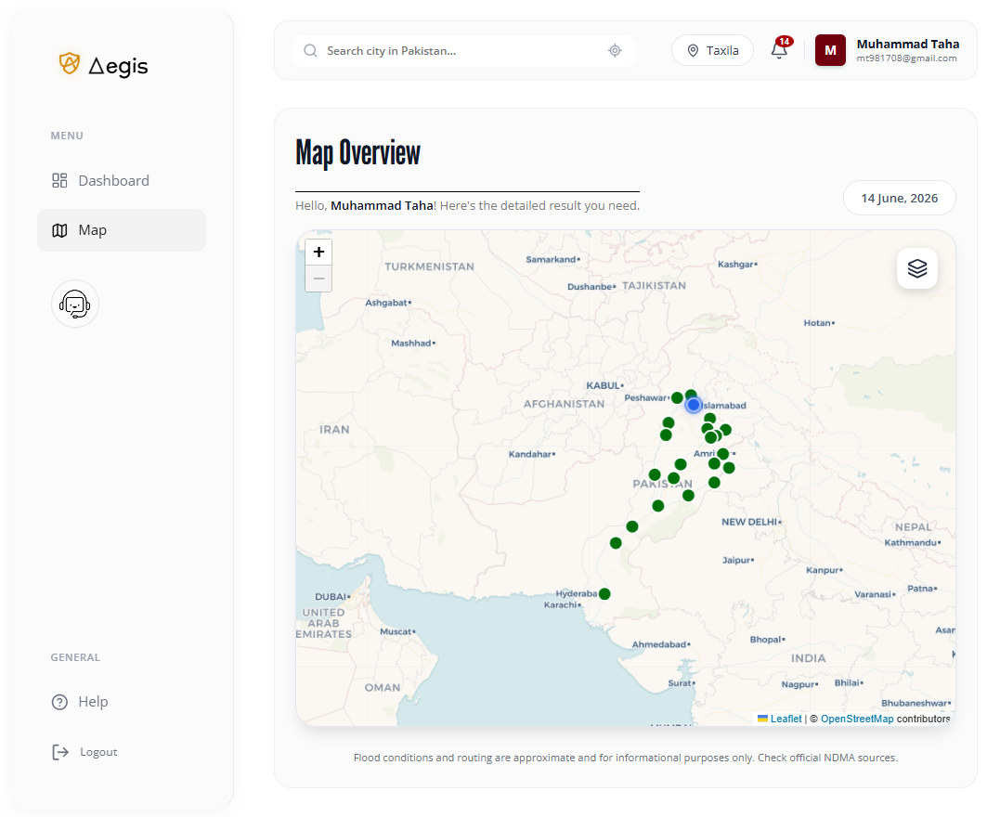

# 🌊 Aegis | Smart Flood Prediction & Disaster Assistance

**Transforming flood management from reactive crisis response into proactive community resilience.**

**[🌐 Live Site](https://aegis-frontend-8jn6.onrender.com/) · [🎥 3-Min Demo Video](./github_pictures_for_readme_file/Video%20Project.mp4)**

> ⚠️ **Note:** This repository contains the **frontend only**. The backend (prediction pipeline, AI arbitration engine, alerting, and NGO coordination services) is closed-source and not included here. This repo showcases the client architecture, UI, and how it consumes the live API.

---

## 📑 Table of Contents
- [What is Aegis?](#-what-is-aegis)
- [Why Was It Built?](#-why-was-it-built)
- [System Architecture](#-system-architecture)
- [Frontend Features](#-frontend-features)
- [Tech Stack](#-tech-stack)
- [Screenshots](#-screenshots)
- [Project Team & Acknowledgments](#-project-team--acknowledgments)

---

## 🌍 What is Aegis?

Aegis is an AI-powered platform designed to predict floods, issue early warnings, and dynamically guide citizens to safety in Pakistan's flood-vulnerable zones. At the heart of the system is a custom **Expert Arbitration Network (EAN)** running on the backend — this frontend is the citizen-facing and NGO-facing surface that turns those predictions into a real-time, usable interface.

👉 **Try it live: [aegis-frontend-8jn6.onrender.com](https://aegis-frontend-8jn6.onrender.com/)**

## 🎯 Why Was It Built?

Pakistan's traditional disaster response infrastructure suffers from a critical "last-mile" communication gap — warnings arrive late, are communicated in complex hydrological jargon, and rely on internet infrastructure that fails during active crises. This frontend was built to close that gap for the end user:

1. **Comprehension:** Presents plain-language safety instructions (English and Urdu) instead of raw hydrological data.
2. **Reach:** Built as an offline-capable Progressive Web App (PWA) so navigation and shelter info stay usable during cellular blackouts.
3. **Coordination:** Gives NGOs and rescue workers a single real-time spatial dashboard instead of fragmented channels.

## 🏗 System Architecture

The diagram below shows where this repo sits in the full system — everything outside the "Client Applications" box is a private backend, shown here for context only.

## ✨ Frontend Features

- 🗺️ **Interactive risk & evacuation map** built with Leaflet.js, rendering hyperlocal flood predictions and safe-route guidance from the backend
- 🌐 **Bilingual UI** — plain-language safety directives displayed in English and Urdu
- 📴 **Offline-capable PWA** — caches shelter locations and last-known safe routes so navigation still works during connectivity loss
- 🆘 **One-click SOS trigger** — captures live GPS and sends it to the backend for NGO dispatch, with UI fallback state if the connection drops
- 📊 **NGO coordination dashboard** — real-time view of active flood zones, shelter occupancy, and incoming distress signals
- 💬 **Chat interface** for the bilingual AI safety assistant

## 💻 Tech Stack

| Domain | Technologies |
| :--- | :--- |
| **Frontend** | React.js, Vite, Leaflet.js, CartoDB |
| **PWA** | Service Worker caching, offline-first routing |
| **Consumes (backend, private)** | FastAPI REST API over HTTPS |
| **Deployment** | Render |

The live site above is deployed against the production backend, so there's nothing extra to configure to try it out.

## 📸 Screenshots

| Hero Page | Citizen Dashboard | Map Overview |
|---|---|---|
|  |  |  |

## 👥 Project Team & Acknowledgments

**Developed By:**
- Muhammad Taha
- Hamza Munir
- Shahzad Babar

---

*Frontend maintained by [Muhammad Taha](https://linkedin.com/in/muhammadtaha02).*
